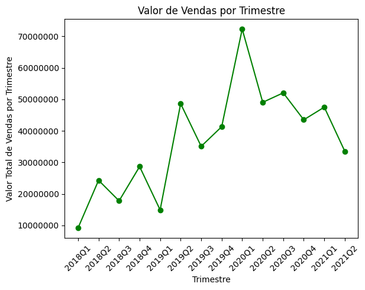
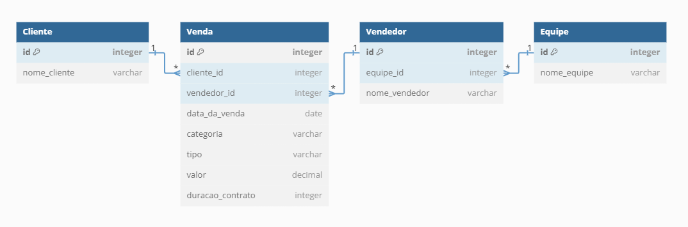

# Descrição do Projeto

Para a implementação do desafio, escolhi utilizar o VSCode com as extensões do Jupyter Notebook. As bibliotecas empregadas foram Pandas, psycopg2, matplotlib e python-dotenv. O banco de dados escolhido foi o PostgreSQL.

## Execução

Para executar o projeto localmente, estando na pasta raiz do projeto execute o seguinte comando no terminal:
```bash
pip install -r requirements.txt
```
Em ambientes como o Google Colab pode ser necessário adicionar uma célula extra nos arquivos e executar:
```bash
!pip install -r requirements.txt
```

Para facilitar o processo da criação do banco de dados criei o script `create_database.py`, que recebe paramêtros do arquivo .env para fazer a conexão com o banco de dados (a porta e o usuário estão definidos com os paramêtros padrões do PostgreSQL).

## Explicação das Soluções
### desafio_parte1.ipynb
- Importando a biblioteca pandas e lendo o arquivo usando o comando `pd.read_csv("./data/DB_Teste.csv", sep=";", encoding="utf-8")`, onde o separador e encoding são definidos para evitar possíveis erros na leitura.
- Após analisar as informações com o comando `df.info()`, identifiquei uma coluna contendo apenas valores vazios, denominada "Unnamed: 10". Optei por excluí-la para limpar o DataFrame.
- Verifiquei a existência de linhas duplicadas e alterei a coluna "Valores" para o formato numérico. Em seguida, salvei um novo arquivo CSV após as alterações.

Tarefas:
1.  Comecei agrupando um novo DataFrame pelos vendedores e somando os valores vendidos. Em seguida, ordenei o resultado de forma decrescente e modifiquei o campo "valor" usando uma função lambda para facilitar a visualização.
2. Utilizando os métodos idxmin e idxmax para encontrar o índice das linhas com a menor e maior ocorrência na coluna "Valor", e em seguida busquei os respectivos clientes usando loc.
3. Comecei agrupando um novo DataFrame pelo tipo e calculando a média dos valores. Em seguida, modifiquei o campo "valor" usando uma função lambda para facilitar a visualização.
4. Usando o método `value_counts`, calculei o número de vendas de cada cliente e modifiquei as colunas para facilitar a visualização.


### desafio_parte2.ipynb
Usando o CSV salvo na parte 1 do desafio, alterei o formato da coluna "Data da Venda" para o tipo datetime. Em seguida, criei uma nova coluna chamada "Trimestre" usando o método to_period() e passei o argumento "Q" para definir os trimestres. Posteriormente, agrupei os trimestres pelo total dos valores e alterei o tipo de dado da coluna "Trimestre" para string para facilitar a plotagem.



### SQL
Criei o diagrama utilizando a ferramenta DBDiagram e todas as queries SQL estão na pasta sql_scripts.


